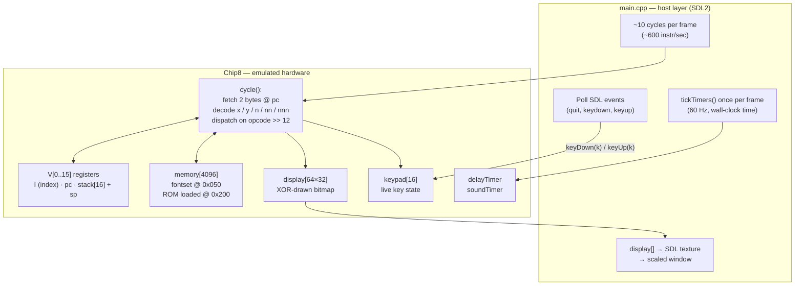

# CHIP-8 Emulator

**▶ [Play it live in your browser](https://shouteck.github.io/chip8-emulator/)**
*(auto-deployed to GitHub Pages by CI — see `.github/workflows/pages.yml`)*

A CHIP-8 interpreter written in C++17 with SDL2. Runs original CHIP-8 ROMs
(Pong, Tetris, Space Invaders) and passes the Timendus chip8-test-suite
opcode and flag tests. Also compiles to WebAssembly via Emscripten for a
playable in-browser demo.

## Architecture

The emulator is split into two layers: the **emulated machine** (`Chip8` class,
a pure state machine with no I/O dependencies) and the **host** (`main.cpp`,
which owns SDL2, timing, and rendering).



Two clocks run on independent schedules inside one frame:

- **Instruction rate** — `cycle()` runs ~10× per frame (~600/sec). This is a
  tunable knob, not tied to wall time.
- **Timer rate** — `tickTimers()` runs once per 60fps frame, so `delayTimer`
  and `soundTimer` decrement at the spec's 60 Hz regardless of CPU speed.

`FX0A` (blocking key-wait) is implemented as a machine-level stall: `cycle()`
returns early while `waitingForKey` is set, and the next `keyDown()` deposits
the key and releases the wait — so the emulated CPU freezes without blocking
the host's event loop.

## Controls

CHIP-8 uses a 16-key hex keypad, mapped as:

```
CHIP-8        Keyboard
1 2 3 C       1 2 3 4
4 5 6 D       Q W E R
7 8 9 E       A S D F
A 0 B F       Z X C V
```

Esc quits.

## Building

Native build (Windows + MSVC + CMake):

1. Download the SDL2 VC development libraries (`SDL2-devel-*-VC.zip` from
   https://github.com/libsdl-org/SDL/releases) and extract to `external/`.
2. Configure and build:

   ```
   cmake -B build
   cmake --build build --config Release
   ```

3. Copy `SDL2.dll` next to the executable.

The WebAssembly build runs in CI (`.github/workflows/pages.yml`) and deploys
the playable demo to GitHub Pages on every push to `main`. Locally it would be:

```
em++ -std=c++17 -O2 -Iinclude src/main.cpp src/chip8.cpp \
  -sUSE_SDL=2 --preload-file roms --shell-file web/shell.html \
  -o dist/index.html
```

## Running

```
chip8.exe roms/Tetris.ch8  # any ROM
chip8.exe                  # defaults to roms/Pong.ch8
```

## Testing

Verified against the Timendus chip8-test-suite:

| ROM | Result |
|-----|--------|
| 3-corax+.ch8 | all opcodes pass |
| 4-flags.ch8  | all flag checks pass (incl. VF-as-operand) |
| 6-keypad.ch8 | all 16 keys mapped correctly |

## Design decisions & quirks

CHIP-8 has no single authoritative spec — the original COSMAC VIP interpreter
and the later SUPER-CHIP implementations disagree on several instructions.
These are the dialect choices made here, plus the spec ambiguities found
along the way.

**Flag semantics (`8XY5` / `8XY7`).** Cowgod's reference says "if Vx > Vy
then VF = 1" — but the same line defines VF as *NOT borrow*, and equal
operands don't borrow. The correct semantics are `Vx >= Vy`, matching the
original VIP behavior. Verified empirically: the flags test suite explicitly
checks `10 - 10` and expects VF = 1.

**VF as an operand.** Any `8XY?` instruction can use `VF` as its `x` or `y`
register, which creates a subtle ordering hazard: writing `VF` before reading
the operands destroys the input, and writing the result after the flag loses
the flag. All arithmetic/shift cases snapshot operands into temporaries first,
then write the result, then write `VF` last — so the flag always wins when
`x == 0xF`. This was caught by the flags test, not by any game.

**Shift quirk (`8XY6` / `8XYE`).** The VIP shifted `V[y]` into `V[x]`; most
modern interpreters shift `V[x]` in place. This implementation uses the modern
in-place form, which is what current ROMs expect.

**Memory dump quirk (`FX55` / `FX65`).** The VIP incremented `I` by `x+1`
after the dump; modern ROMs expect `I` unchanged. Left unchanged here.

**Sprite wrapping (`DXYN`).** Sprites wrap at screen edges via modulo
coordinates, per the original spec.

**Blocking input (`FX0A`).** "Wait for keypress" can't actually block — a
blocking `cycle()` would starve the SDL event pump and the keypress could
never arrive. Implemented as a machine-level stall: `cycle()` returns early
while a flag is set, and the next `keyDown()` deposits the key and releases
the wait. The emulated CPU freezes; the host keeps running.

**Decoupled clocks.** Instruction throughput (~600/sec, tunable) and timer
rate (fixed 60 Hz, tied to frame time) run on independent schedules — games
program against wall-clock timers regardless of CPU speed. On WebAssembly
this falls out naturally: `requestAnimationFrame` paces `tickTimers()` at
60 Hz for free.

**Testing approach.** Correctness is verified against the Timendus
chip8-test-suite rather than "games seem to run." The flags test caught the
`VF`-operand ordering bugs above — failures no amount of Pong would have
exposed.

**Known limitation.** Sprites flicker during animation: `DXYN` updates the
framebuffer mid-frame and intermediate erase-redraw states are visible.
Classic interpreters sync draws to vblank; left as-is since the flicker is
instructive — it's literally the XOR erase/redraw cycle made visible.
