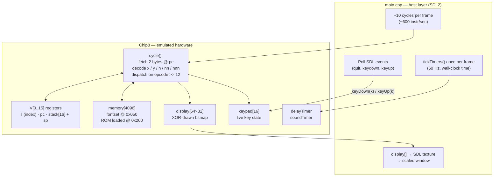

# CHIP-8 Emulator

**▶ [Play it live in your browser](https://shouteck.github.io/chip8-emulator/)**
*(auto-deployed to GitHub Pages by CI — see `.github/workflows/pages.yml`)*

A CHIP-8 interpreter written in C++17 with SDL2. Runs original CHIP-8 ROMs
(Pong, Tetris, Space Invaders) and passes the Timendus chip8-test-suite
opcode and flag tests. Also compiles to WebAssembly via Emscripten for a
playable in-browser demo.

## Architecture

The emulator is split into two layers: the **emulated machine** (`Chip8` class,
a pure state machine with no I/O dependencies) and the **host** (`main.cpp`,
which owns SDL2, timing, and rendering).



Two clocks run on independent schedules inside one frame:

- **Instruction rate** — `cycle()` runs ~10× per frame (~600/sec). This is a
  tunable knob, not tied to wall time.
- **Timer rate** — `tickTimers()` runs once per 60fps frame, so `delayTimer`
  and `soundTimer` decrement at the spec's 60 Hz regardless of CPU speed.

`FX0A` (blocking key-wait) is implemented as a machine-level stall: `cycle()`
returns early while `waitingForKey` is set, and the next `keyDown()` deposits
the key and releases the wait — so the emulated CPU freezes without blocking
the host's event loop.

## Controls

CHIP-8 uses a 16-key hex keypad, mapped as:

```
CHIP-8        Keyboard
1 2 3 C       1 2 3 4
4 5 6 D       Q W E R
7 8 9 E       A S D F
A 0 B F       Z X C V
```

Esc quits.

## Building

Native build (Windows + MSVC + CMake):

1. Download the SDL2 VC development libraries (`SDL2-devel-*-VC.zip` from
   https://github.com/libsdl-org/SDL/releases) and extract to `external/`.
2. Configure and build:

   ```
   cmake -B build
   cmake --build build --config Release
   ```

3. Copy `SDL2.dll` next to the executable.

The WebAssembly build runs in CI (`.github/workflows/pages.yml`) and deploys
the playable demo to GitHub Pages on every push to `main`. Locally it would be:

```
emcc -std=c++17 -O2 -Iinclude src/main.cpp src/chip8.cpp \
  -sUSE_SDL=2 --preload-file roms --shell-file web/shell.html \
  -o dist/index.html
```

## Running

```
chip8.exe roms/Tetris.ch8  # any ROM
chip8.exe                  # defaults to roms/Pong.ch8
```

## Testing

Verified against the Timendus chip8-test-suite:

| ROM | Result |
|-----|--------|
| 3-corax+.ch8 | all opcodes pass |
| 4-flags.ch8  | all flag checks pass (incl. VF-as-operand) |
| 6-keypad.ch8 | all 16 keys mapped correctly |

## Design decisions & quirks

<!-- TODO: this is the section to write yourself — the interesting decisions:
     - shifts (8XY6/8XYE) operate on V[x] directly (modern quirk), not V[y]
     - FX55/FX65 leave I unchanged (modern quirk)
     - sprites wrap at screen edges
     - Cowgod's spec says "Vx > Vy" for 8XY5/8XY7 flag, but NOT-borrow
       semantics require >= (verified against test suite / VIP behavior)
     - flag ordering: all operand reads happen before writes so VF works
       correctly as an operand (x or y == F)
     - FX0A implemented as CPU stall + keydown release, not a blocking loop
-->
